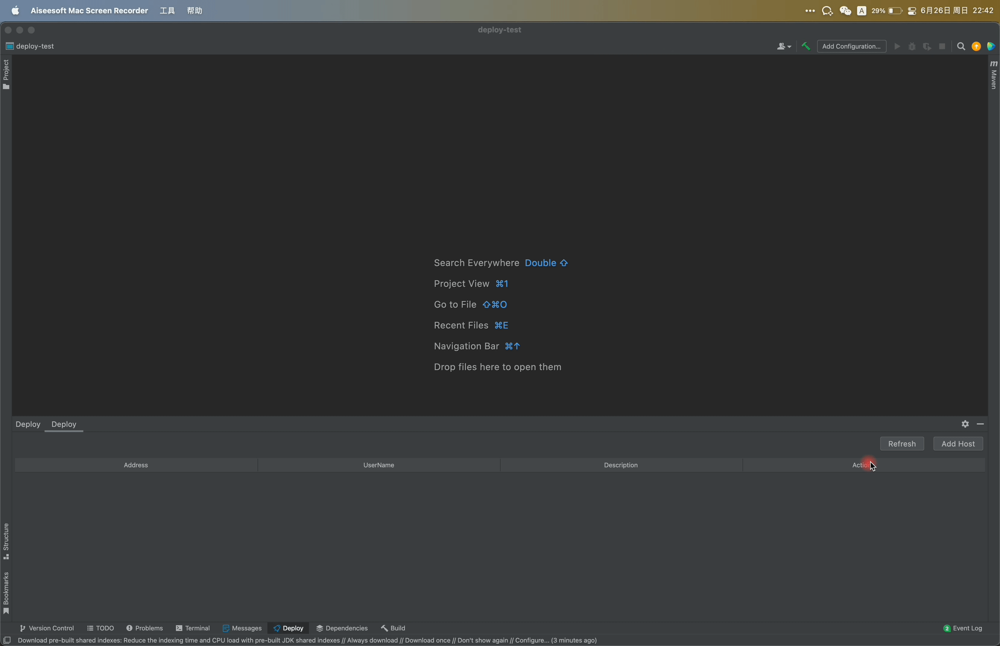
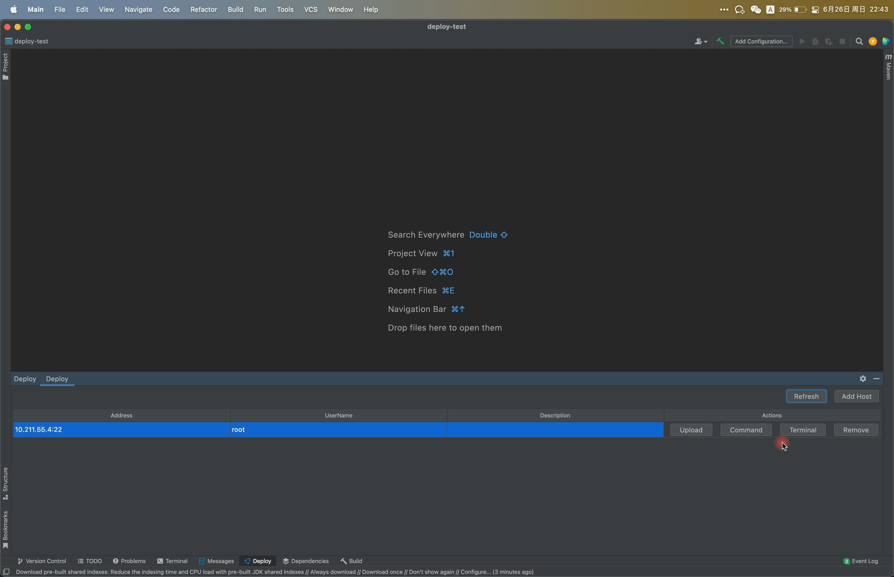

<h1 align="center">Easy Deploy</h1>

Convenient Intellij Platform Plugin for Deploying and Upgrading Services during Development

    
    
    
    

[**简体中文**](README_zh_CN.md) 🐼

Easy Deploy is a plugin I developed, drawing inspiration from the Alibaba Cloud Toolkit. Its purpose is to streamline 
the process of deploying services during my development workflow.

Compared to the Alibaba Cloud Toolkit, my plugin has significantly fewer features. The functionalities of ACT seemed a 
bit excessive for my needs, so I chose to focus only on the aspects that matter most to me, primarily centered around 
server management and deployment processes.

I named this plugin Easy Deploy because its functionalities are indeed straightforward. While it may have limited 
capabilities, I plan to continuously optimize it and add new features to enhance its completeness.

This marks my first venture into developing an IntelliJ IDEA plugin. Throughout the development process, I encountered 
numerous challenges, which I addressed through extensive research and learning. In the future, I intend to document my 
experiences in developing this plugin to share insights with fellow developers.

👉👉 [Find in plugin marketplace](https://plugins.jetbrains.com/plugin/19432-easy-deploy)

🪐🪐 [My Blog](https://www.lin2j.tech)

# Support

If this plugin proves helpful to you, please consider showing your support by giving the repository a star ⭐️⭐️.

# Features

## Server management

You can use this plugin to add multiple servers and then execute commands, upload files, and deploy applications based 
on these servers.

The login passwords for servers can be stored or left unstored. If not stored, a password input box will pop up when 
needed.

The password storage for servers is implemented through IDEA's own password storage mechanism, so you don't need to 
worry about leakage due to plaintext storage.

After adding a server, you can directly establish an SSH connection through the terminal button. This feature is 
implemented by CloudTerminalRunner, allowing even the Community Edition of IntelliJ IDEA to use this functionality.

In fact, there is already a well-implemented AbstractTerminalRunner in the com.intellij.modules.ultimate module under 
the remote-run plugin. However, the Community Edition cannot use this plugin.

After consideration, I decided to try to use the APIs of the Community Edition as much as possible to accommodate users 
of the Community Edition.

## Command management

You can add some backup commands for a specific server and execute them directly. The commands for each server are 
isolated, which helps with command management.

When adding commands, you need to use an absolute path to specify the directory where the command will be executed on 
the remote server.

Currently, only simple commands can be executed. For overly complex commands, it is recommended to write them as scripts
and then execute the script on the server. This is the approach I usually take when deploying services.

If you use commands like `tail -f` that do not return all information at once, it will cause the current thread to block
because the stream being read has not received a termination signal.

## File upload

You can use the upload button on the panel to upload local files. Currently, downloading files from the server is not 
supported. In the future, I hope to make it similar to Xftp software, allowing free file transfer between the server 
and the local machine.

I combine the locally selected files and remote directories as an upload configuration to manage. This way, you don't 
need to repeat the selection of local files and remote directories the next time you use it.

## Deployment

For deployment, we can only use some simple methods. First, upload the program files to the specified remote directory, 
and then execute the startup command in that directory. This is generally the sequence I follow for deploying services.

The deployment plan is essentially based on the upload configuration, where you select the commands to be executed after
uploading.

# TODO

- [x] Add/Edit/Remove Server Information
- [x] Add/Edit/Remove Commands
- [x] Upload Files or Directories with Filtering Support
- [x] Deploy Services
- [x] Open Terminal
- [x] SSH Passwordless Login (Private Key Login)
- [ ] Configuration Import/Export
- [x] Server Search
- [ ] File Transfer Panel
 
# contact me 🐾

I'm relatively new to developing Idea plugins, so there might be some shortcomings in addressing certain issues.

If you have any suggestions or encounter bugs, feel free to raise issues or contact me via email. I'll respond as 
promptly as possible.

📮📮 linjinjia047@163.com

# License

[**MIT**](LICENSE).
